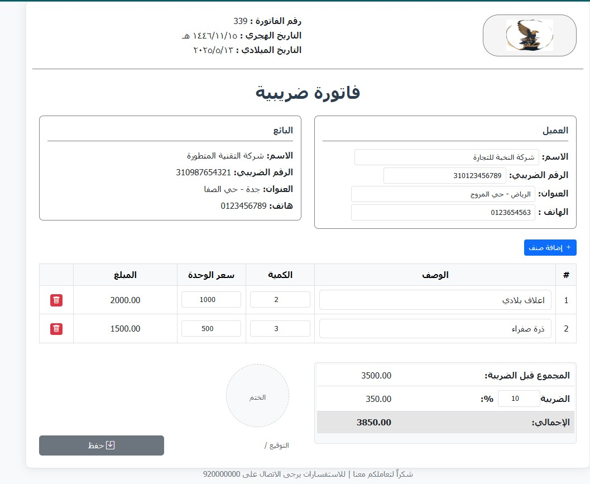

# 🧾 E-Receipt Web Application

This is a simple and responsive E-Receipt (Invoice) web application built with **HTML, CSS, Bootstrap, and JavaScript**.  
It allows users to create tax invoices for businesses or clients and supports downloading or printing the receipt for official use.

## 🚀 Features

- ✅ **Dynamic Item Management**  
  Easily add or remove invoice line items with quantity, unit price, and description.

- ✅ **Real-Time Calculations**  
  The total price is calculated automatically as you update quantity or price.

- ✅ **Dynamic Tax Calculation**  
  Tax is calculated dynamically based on a user-defined percentage.

- ✅ **Buyer and Seller Info**  
  Includes customizable fields for both the seller and the buyer (names, tax numbers, addresses, and phone numbers).

- ✅ **PDF Export**  
  Save your invoice as a **PDF file** directly to your PC.

- ✅ **Print Support**  
  Print the receipt using your printer with clean formatting.

- ✅ **Modern UI**  
  Clean and professional user interface designed using **Bootstrap**.

## 🧑‍💼 Use Cases

- Small business owners issuing digital receipts
- Freelancers and consultants generating client invoices
- Storekeepers or shops wanting printable and shareable invoices

## 🛠️ Technologies Used

- **HTML5**
- **CSS3**
- **Bootstrap 5**
- **Vanilla JavaScript**

## 📸 Screenshot



## 📄 How to Use

1. Clone the repository
   ```bash
   git clone https://github.com/abdallaskar/E-Receipt
   ```
